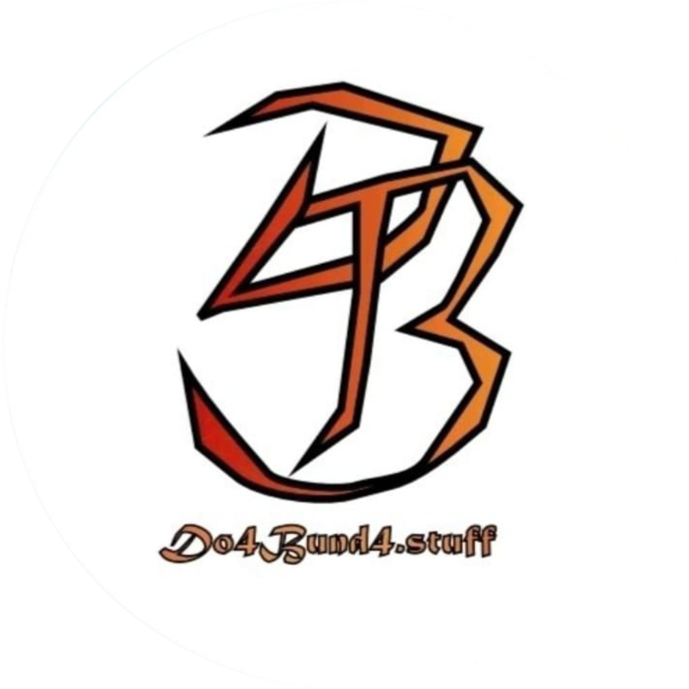

# DoaBunda



**DoaBunda** adalah platform web yang mendukung penjualan produk fashion bekas berkualitas (preloved). Proyek ini dibuat sebagai bagian dari Ujikom dan bertujuan untuk membantu pelaku UMKM, khususnya teman saya (reseller), dalam menjual produk fashion secara efisien dan modern.

## 🔧 Tech Stack

- **PHP** 8.2.*
- **Laravel** 11
- **Laravel Filament** 3
- **Sweet Alert** 2
- **Database:** MySQL / MariaDB
- **Frontend:** Tailwind V4
- **Template Engine:** Blade Templating Engine

---

## Fitur Utama

### Untuk Customer
-  Register & Login
-  Lihat dan ubah profil
-  Jelajahi produk
-  Lihat detail produk & hubungi penjual
-  Tambah ke wishlist
-  Lihat dan kirim testimoni

### Untuk Admin
-  Dashboard Admin
-  CRUD Kategori Produk
-  CRUD Data Customer
-  CRUD Produk
-  CRUD Testimoni Permission

---

## Cara Instalasi Proyek

### 1. Clone Proyek
```bash
git clone https://github.com/KevinSinatria/doabunda-uijkom-11-2.git
cd doabunda-uijkom-11-2
```

### 2. Install Dependency Laravel
```bash
composer install
```

### 3. Copy File Environment
```bash
cp .env.example .env
```

---

## 🗄️ Konfigurasi Database

### 1. Pastikan kamu sudah mendownload database nya:
[](https://www.mediafire.com/file/ssothz4wxc8d144/db_doabunda.sql/file)

### 2. Buat Database Baru
Masuk ke MySQL dan buat database baru (misalnya `db_doabunda`):

```sql
CREATE DATABASE db_doabunda;
```

### 3. Import Database DoaBunda ke dalam Database yang sudah kamu buat

### 4. Konfigurasi File .env
Ubah bagian konfigurasi database di file `.env`:

```ini
DB_CONNECTION=mysql
DB_HOST=127.0.0.1
DB_PORT=3306
DB_DATABASE=db_doabunda
DB_USERNAME=root
DB_PASSWORD= # isi sesuai konfigurasi MySQL kamu
```

---

## 🖼️ Menjalankan Proyek

```bash
php artisan serve
```

**Akses aplikasi di browser:** [http://127.0.0.1:8000](http://127.0.0.1:8000)

---

## Akun Demo

###  Akun Admin
- **Email:** admin@gmail.com
- **Password:** 5908.bdg

###  Akun Customer
- Coba fitur register untuk membuat akun baru dengan role customer

---

## 📁 Struktur Folder Utama

```
doabunda/
├── app/                    # Logic aplikasi (Models, Controllers, dll)
├── routes/                 # Route definitions
├── resources/
│   └── views/             # Blade templates
├── database/
│   └── migrations/        # Database migrations
├── public/                # Assets publik (CSS, JS, images)
├── .env                   # Environment configuration
└── README.md             # Dokumentasi proyek
```

---

## 🌱 Tentang Sustainable Fashion

DoaBunda mendukung gerakan sustainable fashion melalui:
- ♻️ **Reduce:** Mengurangi limbah fashion
- 🔄 **Reuse:** Memberikan kehidupan kedua untuk pakaian berkualitas
- 🌍 **Recycle:** Mendukung ekonomi sirkular

---

## 📄 Lisensi

Proyek ini dibuat untuk tujuan pembelajaran dan tugas sekolah. Bebas digunakan dan dimodifikasi dengan mencantumkan kredit.

---

## 🤝 Kontributor

- **Kevin Sinatria Budiman** - Project Manager & Developer

---

## 📞 Dukungan

Jika ada pertanyaan atau masalah terkait proyek ini, silakan buat issue di repository atau hubungi kontributor.

---

<div align="center">
  
**Made with ❤️ for Sustainable Fashion Movement**

*DoaBunda - Supporting Local Businesses, Supporting Earth* 🌍

</div>
